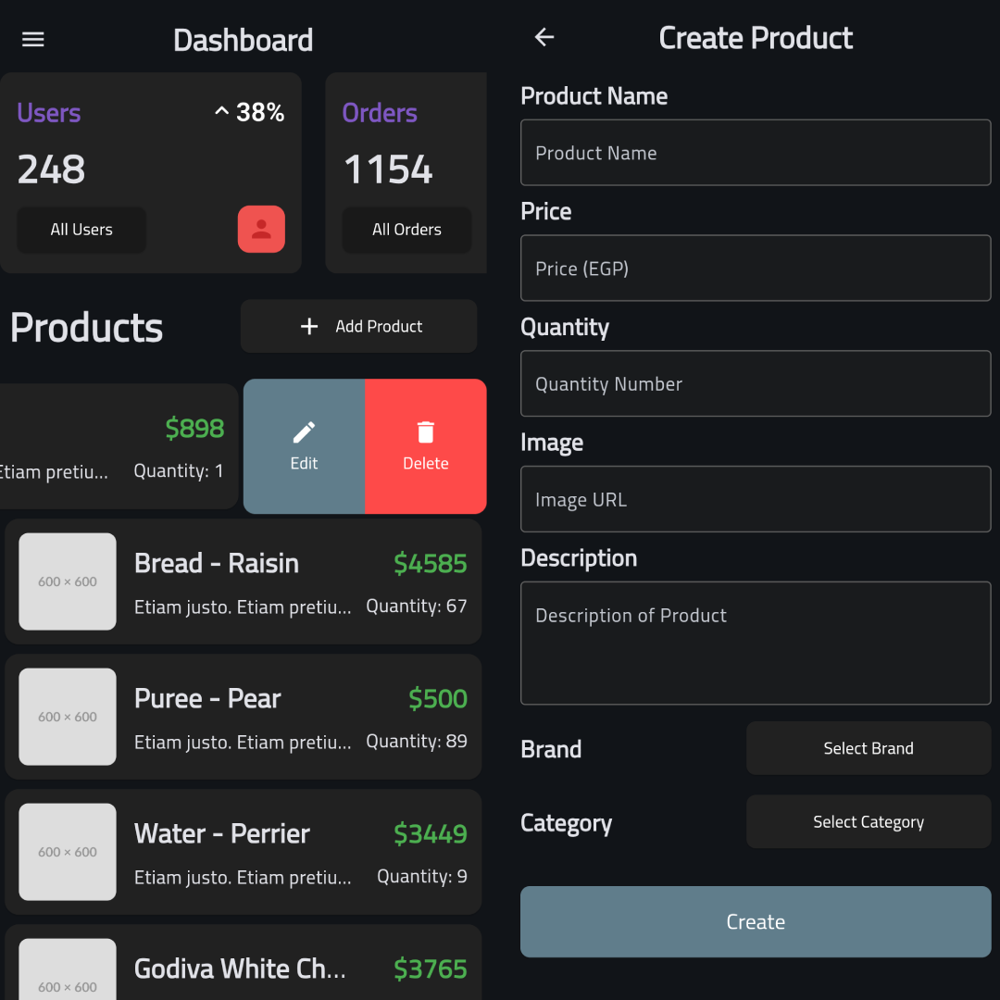
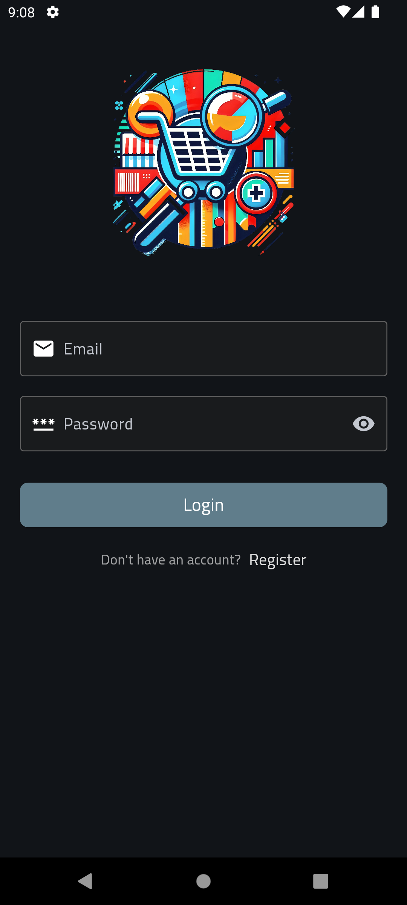
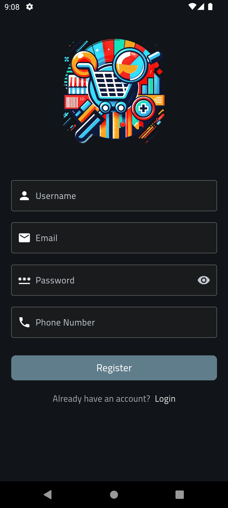
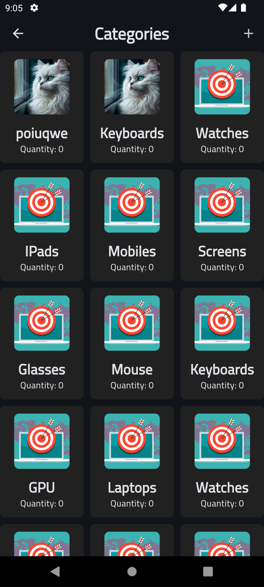
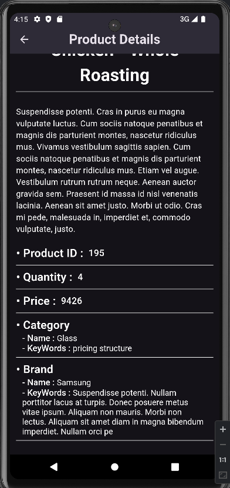

# Admin Dashboard

## 🖼 Screenshots

| Login Overview                            | Register Overview                         |
| ----------------------------------------- | ----------------------------------------- |
|  |  |

| Category Management                   | Product Management                             |
| ------------------------------------- | ---------------------------------------------- |
|  |  |

## 🚀 Overview

The **Admin Dashboard** is a Flutter-based application designed for managing categories, brands, and products with a modern UI optimized for dark mode. It provides administrators with an intuitive interface to manage inventory efficiently.

### Key Features:

- 📦 **Category Management:** Add, update, and delete product categories.
- 🏷️ **Brand Management:** Manage brands by creating, editing, and removing entries.
- 🛍️ **Product Management:** Assign products to specific brands and categories, and modify details.
- 🌙 **Dark Mode Support:** Fully optimized for dark mode.

This dashboard is built for scalability and can be integrated with various backend technologies, making it a powerful tool for inventory and product management.

## 🛠 Technologies

- **Framework:** Flutter
- **State Management:** Cubit / Bloc
- **Database:** API
- **Authentication:** JWT
- **UI Components:** Material Design / Custom Widgets

---

⭐ Don't forget to star this repo if you find it useful! ⭐
